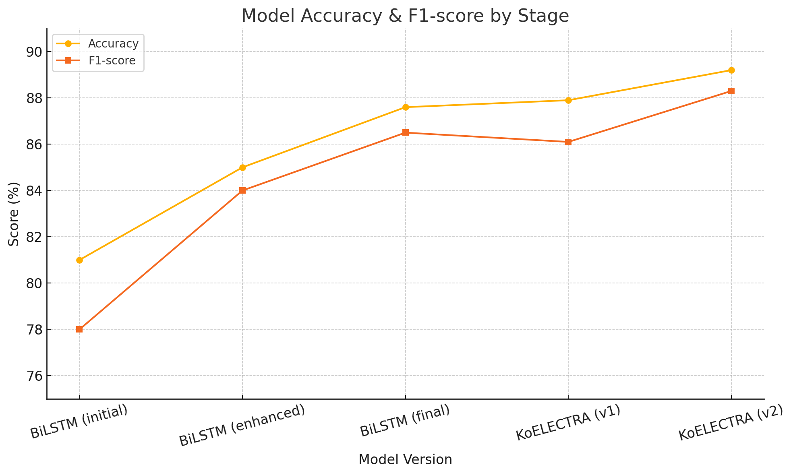

# Sentiment Classification

# 리뷰 감정 분석기 & 워드클라우드 생성기

본 프로젝트는 웹에서 수집한 음식점 리뷰 데이터를 기반으로, 감정을 자동으로 분류하고 키워드를 시각화하는 자연어처리 기반 웹 애플리케이션입니다.  
`딥러닝 기반 자연어처리` 모델을 활용하여 문장의 감정을 부정 / 중립 / 긍정으로 분류하며, 리뷰 전체에 대한 워드클라우드 시각화 및 통계 분석 기능도 함께 제공합니다.

---

## 📌 프로젝트 목적

- 실사용 가능한 감정 분석 웹앱 구현
- 다양한 모델을 실험하고 비교하여 최적 모델 선정 (KoELECTRA)
- 웹에서 수집한 리뷰 데이터로 자연어처리(NLP) 파이프라인 실습
- 감정 분석 결과를 직관적으로 확인할 수 있는 워드클라우드 및 감정 분포 시각화 제공

---

## 📁 프로젝트 구조


| 폴더/파일명                        | 설명                                         |
|------------------------------------|----------------------------------------------|
| `data/`                            | 크롤링 및 전처리된 리뷰 데이터 폴더         |
| ├── `cleaned_reviews.csv`         | 2차 전처리 데이터                            |
| ├── `cleaned_reviews_strong.csv`  | 감정 강도 높은 리뷰만 추린 3차 전처리 데이터 |
| └── `labeled_reviews_lmstudio_cleaned.csv` | 수작업 라벨링된 1차 전처리 데이터     |
| `models/`                          | 학습된 감정 분석 모델 폴더                  |
| ├── `koelectra_sentiment_model_tf_updated/` | 커리큘럼 구성 후 훈련된 KoELECTRA 모델 |
| └── `koelectra_sentiment_model_tf/` | 1차 KoELECTRA 모델                        |
| `plots/`                           | 학습 결과 시각화 이미지                     |
| ├── `confusion_matrix.png`        | 혼동 행렬 이미지                            |
| ├── `precision_recall_curve.png`   | 정밀도-재현율(PR) 곡선                     |
| ├── `system_chart.png`           | 시스템 구조도  |
| ├── `data_chart.png`           | 대용량 → 수작업 라벨링 → 학습 데이터 흐름도  |
| ├── `precision-recall-f-score.png`| 손실값 변화 시각화                          |
| └── `model_progress.png`          | 모델 성능 개선 과정 종합 시각화             |
| `train_sentiment_model.py`        | BiLSTM 모델 학습 코드                        |
| `train_koelectra_sentiment.py`    | KoELECTRA 모델 학습 코드                    |
| `review.py`                        | 전처리 및 리뷰 처리용 모듈                  |
| `save.py`                          | 모델 저장 유틸리티                          |
| `requirements.txt`                | 실행 환경 패키지 목록                        |
| `README.md`                        | 프로젝트 설명 파일                           |

---

## 🧾 사용한 기술 스택

| 항목         | 도구 |
|--------------|------|
| 모델 훈련     | TensorFlow, HuggingFace Transformers (KoELECTRA) |
| NLP 분석     | KoNLPy (Okt), Tokenizer |
| 시각화       | matplotlib, seaborn |
| 전처리       | pandas, numpy |
| 환경         | Python 3.10, Git LFS |
| 실행 플랫폼  | Streamlit (별도 서비스 리포지토리 참고) |

---

## 🧠 감정 분류 모델

- **모델**: TFElectraForSequenceClassification (KoELECTRA 기반)
- **분류 대상**: 부정(0), 중립(1), 긍정(2)
- **학습 데이터**: 웹 크롤링으로 수집한 음식점 리뷰 (라벨링 포함)
- **학습 환경**: CPU 환경에서 작동 가능 (Anaconda 가상환경 사용)

---

## 🧪 데이터 분석 및 재정비 과정

- **400,000+개 가량의 원시 데이터** 사용
- **라벨, 정제 후 약 10,890개의 리뷰 수로 단축 / Train Set : 80% (8712개) / Validation Set : 20% (2178개)**
  
- 원본 리뷰 데이터에서 감정 표현이 약한 문장을 필터링
- 감정 강도 높은 리뷰만 별도 데이터셋(`cleaned_reviews_strong.csv`) 구성
- 수작업 라벨링된 결과를 기준으로 `train_test_split` 수행
- 

##  📚 데이터 커리큘럼 구성 배경

초기 학습에 사용한 데이터셋은 원시 리뷰 데이터를 단순 정제한 수준으로 모델이 애매한 문장에 과적합되거나, 성능 향상에 한계가 있는 현상이 발견됨. 이 문제를 해결하기 위해 2단계에 걸쳐 데이터 커리큘럼을 재구성함.

| 단계 | 내용 | 목적 |
|------|------|------|
| **1차 재정비** | - 특수문자 제거<br>- 중복 리뷰 제거<br>- 라벨 오류 수정<br>- 감정 미약 문장 제거 | 데이터 품질 향상 및 노이즈 제거 |
| **2차 재정비 (커리큘럼 구성)** | - 감정 강도 높은 리뷰만 필터링<br>- `cleaned_reviews_strong.csv` 구성<br>- 학습 우선순위 부여 | 모델에 강한 학습 신호부터 전달하여 일반화 성능 향상 |

> 🔎 위 과정은 **단순 정제 → 감정 신호 중심 커리큘럼 학습**으로 이어지는 전략적 데이터 구성이며, KoELECTRA 성능 향상(Accuracy 89.2%)에 핵심 기여를 함.

---

## 🧭 전체 코드 실행 흐름 요약

| 단계 | 주요 파일 | 설명 |
|------|-----------|------|
| 1️⃣ 데이터 전처리 | `review.py` | 원본 리뷰를 정제하고 불필요한 문장 제거 및 라벨링 적용 |
| 2️⃣ 학습 데이터 구성 | `data/*.csv` | 감정 강도 기반 필터링 및 커리큘럼 학습용 데이터셋 분리 |
| 3️⃣ 모델 학습 | `train_koelectra_sentiment.py` | KoELECTRA 모델을 데이터에 맞춰 학습 (가중치 보정 포함) |
| 4️⃣ 모델 저장 | `save.py` | 학습 완료된 모델을 `.h5` 또는 Transformers 포맷으로 저장 |
| 5️⃣ 성능 평가 및 시각화 | `plots/*.png` | F1-score, 정확도, 혼동행렬 등 시각화 자료 자동 생성 |
| 6️⃣ 예측 및 추론 | (예시 코드 포함) | 임의 문장 입력 시 감정 클래스 예측 수행 |

---

## 📈 모델 개선 및 성능 변화 과정

본 프로젝트는 반복적인 실험을 통해 모델 성능을 개선하고 최종적으로 KoELECTRA 기반 모델을 선택하게 되었습니다.

### 1. 실험 이력 및 성능 비교



|             단계            |                     설명                     | Accuracy | F1-score 
|-----------------------------|----------------------------------------------|----------|-----------
| **1.    BiLSTM (초기)**     | 기본 구조/전처리 최소                          |   81.0%  | 78.0
| **2. BiLSTM (전처리 강화)** | 텍스트 정제, 중복 제거, 감정 강도 필터링        |   85.0%  | 84.0
| **3.    BiLSTM (튜닝)**     | Dropout, Layer 수 조정 등 하이퍼파라미터 개선  |   87.6%   | 86.5
| **4.  KoELECTRA (1차)**     | 사전학습 기반 모델로 문맥 이해 강화            |   87.9%   | 86.1
| **5.  KoELECTRA (2차)**     | **가중치 보정 및 커리큘럼 학습 적용**        | **89.2%** | **88.3**

> ✔ 최종 선택: KoELECTRA(2치) – 일반화 성능이 뛰어나고 실제 사용자 리뷰에 강건하게 작동함
> - ✅ 본 모델(`koelectra_sentiment_model_tf_updated/`)은 웹 서비스에 최종적으로 적용된 모델입니다.


### 2. KoELECTRA 세부 개선 전략 (가중치 기반 튜닝)

| 항목 | 내용 |
|------|------|
| **문제** | - 중립 클래스(1)의 F1-score가 낮게 나타남<br>- 긍정 리뷰 비중 과다 → 클래스 불균형 문제 |
| **전략** | - `class_weight`를 활용해 손실 함수에 클래스별 가중치 부여<br>예: `{0: 1.2, 1: 2.5, 2: 0.8}` |
| **효과** | - 중립 클래스의 F1-score가 0.6168 → **약 0.68**로 향상<br>- 전체 모델의 균형 및 실제 적용력 향상 |

> ✅ 위 과정은 단순 학습을 넘은 **비즈니스 적용 가능성 고려 튜닝 전략**이며,  
> KoELECTRA 모델이 **실서비스 환경에 적합한 성능**을 갖췄음을 뒷받침합니다.

### 3. 시각화 자료

- 📊 혼동 행렬:
  
- 🧮 정밀도-재현율 곡선:
   
- 🧾 클래스별 Precision / Recall / F1-score:
  

---

## 🔁 Git LFS 및 모델 관리

- 대용량 모델(`.h5`)은 Git LFS로 업로드
- `.gitattributes` 설정 및 `git lfs track` 사용
- 모델 버전 관리를 위해 커밋 히스토리 클린업 진행

---

## 🛠️ 설치 및 실행 방법

### 1. Conda 가상환경 설정 (Python 3.10 기준)
```bash
conda create -n sentiment_env python=3.10
conda activate sentiment_env
```

### 2. 필수 패키지 설치
```bash
pip install -r requirements.txt
```

### 3. 모델 로드 및 예측 수행
```python
from transformers import ElectraTokenizerFast, TFElectraForSequenceClassification
import tensorflow as tf

model_path = "models/koelectra_sentiment_model_tf_updated"
tokenizer = ElectraTokenizerFast.from_pretrained(model_path)
model = TFElectraForSequenceClassification.from_pretrained(model_path)

text = "이 집 음식 너무 맛있어요!"
inputs = tokenizer(text, return_tensors="tf", truncation=True, padding=True)
outputs = model(**inputs)
label = tf.argmax(outputs.logits, axis=1).numpy()[0]
print("감정 예측 결과:", label)  # 0=부정, 1=중립, 2=긍정
```

---

---

## 🧾 관련 프로젝트 및 시연

본 리포지토리는 모델 학습 및 평가에 초점을 두고 있으며,
웹 기반 감정 분석 서비스는 아래 리포지토리에서 확인할 수 있습니다:

👉 [Sentiment-Classification-Service](https://github.com/Xox00xoX/Sentiment-Classification-Service)
